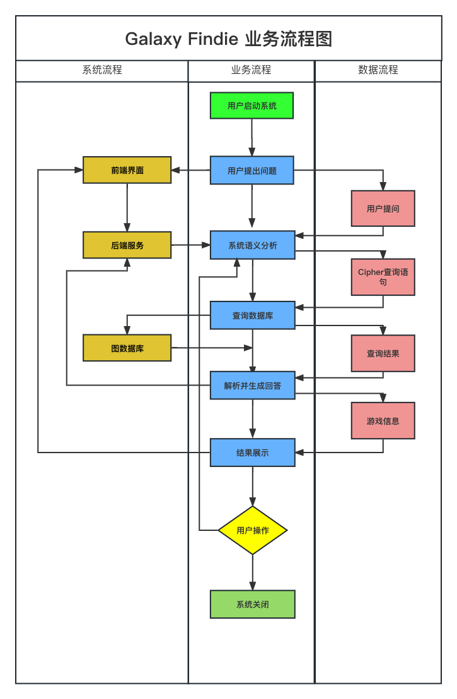
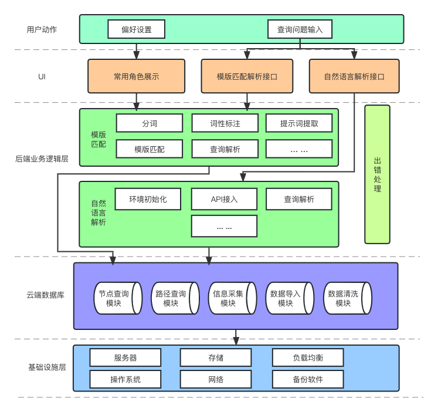

# Galaxy Findie - 崩坏：星穹铁道聊天机器人 需求分析文档

## 一、引言
   - 项目名称：Galaxy Findie - 崩坏：星穹铁道聊天机器人
   - 项目承担者：王景宽、李积栋、刘晨阳、谢天、李天艺

 ### 1.1 编写目的
  本文档的目的是定义和描述Galaxy Findie(银河查宝)--崩坏：星穹铁道聊天机器人的功能、性能、环境等需求以及系统架构。
 ### 1.2 名词解释
   - 崩坏：星穹铁道(Honkai: Star Rail)：一款由米哈游开发的游戏。
   - 聊天机器人：软件系统，用于回答用户提出的游戏相关问题。
 
 ### 1.3 项目背景
   崩坏：星穹铁道是一款由米哈游(miHoYo)开发的回合制RPG游戏，于2023年4月26日正式运营。游戏以银河冒险为题材。玩家在游戏中将扮演“开拓者”，跟随游戏主线探索不同的星球，完成关卡、宝箱收集、解谜和支线任务等内容，并使用获得的资源强化角色和道具。
   
   在崩坏：星穹铁道游戏中，了解角色属性、光锥、材料等游戏内的重要信息将对玩家规划养成路线和深入了解游戏背景故事带来很大的帮助。然而作为一款新上线的游戏，非重度玩家对游戏中的角色、光锥、材料和怪物等主体还并不了解。更方便、快捷地获取准确、详细的游戏信息可能是一项挑战。
   
   为了解决这个问题，我们决定设计并开发 Galaxy Findie (中文名：银河查宝) 这款崩坏：星穹铁道聊天机器人。基于图数据库存储崩坏：星穹铁道游戏相关信息，并根据用户提出的问题进行查询和检索，为用户提供高效、边界和灵活的信息查询服务。
   
   Findie（中文名：查宝）是游戏中"星际和平家电"公司生产的一款家用智能寻物机器人，用于寻找丢失的物品。基于这个背景，我们为项目取名为 Galaxy Findie，表示该项目能够为用户在崩坏：星穹铁道的游戏世界中发现和探索资讯。
   
### 1.4 项目目标
   - 开发出一个图数据库，用于存储崩坏：星穹铁道的游戏相关信息并构建游戏中实体的知识图谱。
   - 开发出一个功能强大、易于使用的崩坏：星穹铁道聊天机器人系统，为玩家提供准确、全面的游戏信息支持，帮助他们更好地享受游戏，了解背景故事和规划养成路线，并提升他们在崩坏：星穹铁道中的战斗能力和游戏体验。

### 1.5 用户描述
   - 崩坏：星穹铁道游戏玩家：指已经在崩坏：星穹铁道游戏中注册并参与游戏，或刚开始接触崩坏：星穹铁道游戏或者对游戏尚不熟悉的用户。
   - 崩坏：星穹铁道游戏爱好者：指对崩坏：星穹铁道游戏感兴趣、渴望深入了解游戏细节的用户。
 
### 1.6 与其他系统或机构的关系
 数据及攻略来源：
   - [米游社-崩坏：星穹铁道WIKI](https://bbs.mihoyo.com/sr/wiki/)
   - [崩坏：星穹铁道](https://sr.mihoyo.com/)
   - [`米游社@听语惊花`](https://bbs.mihoyo.com/ys/accountCenter/postList?id=289918413)
  
 云数据库平台：
   - [Neo4j AuraDB](https://neo4j.com/cloud/platform/aura-graph-database/)

 （可选）基于LLM的语义分析与数据解析：
 - [ChatGPT](https://chat.openai.com/)
         
### 1.7 参考资料
   - 崩坏：星穹铁道官方文档
   - Neo4j官方文档
     
## 二、现行系统概括
### 2.1 系统规模
   - 数据库中存储崩坏：星穹铁道1.0版本上半部分（截至2023.5.13)的游戏内容，包括角色及光锥信息、遗器、材料、商店等数据。
### 2.2 系统界限
   - 系统仅提供崩坏：星穹铁道游戏相关信息的查询功能，不涉及其他游戏或领域。
   - 用户可以通过聊天机器人系统提问游戏相关问题，获取准确、详细的回答。
### 2.3 主要功能
   - 提供用户信息展示功能，以便记录用户常用角色信息。
   - 解析用户向系统提出崩坏：星穹铁道游戏相关的问题。
   - 通过图数据库存储游戏数据，实现高效的数据检索和查询响应。
   - 根据用户提问，查询数据库并返回相应的游戏信息。
   - 提供友好的用户界面，使用户可以轻松地与聊天机器人进行交互。
### 2.4 组织结构
   系统由前端界面、后端服务和数据库组成。
   
   - 前端界面负责接收用户输入、展示查询结果和处理用户交互。
   - 后端服务负责接收用户请求、解析请求、处理业务逻辑和与数据库交互。
   - 数据库使用图数据库来存储和管理游戏相关内容数据。
 ### 2.5 业务流程
   1. 用户填写个人信息、启动系统。
   2. 用户提出崩坏：星穹铁道游戏相关的问题。
   3. 系统接收用户的问题并进行语义分析。
   4. 系统查询数据库并返回与问题相关的游戏信息。
   5. 用户收到系统返回的游戏信息并进行进一步操作。
 ### 2.6 数据流程
   1. 用户输入问题并提交给系统。
   2. 系统接收并处理用户的问题，生成查询。
   3. 系统查询数据库并解析结果，获取游戏信息。
   4. 系统将查询结果返回给用户。
 ### 2.7 数据存储及存在的薄弱环节
   - 游戏数据存储在云平台 Neo4j Aura 上的图数据库中，以图的形式存储角色、光锥、材料、怪物等信息。
   
   可能的薄弱环节
   - 云数据库高并发场景下的性能瓶颈。
   - 数据同步更新的延迟。
   - 系统安全管理和漏洞防护。
   
 ### 系统业务流程图
   

## 三、目标系统逻辑设计
### 3.1 功能需求
 1. 用户信息显示 
 
 - 系统支持用户编写和管理个人信息。
 - 系统在前端显示用户的个人信息。
 2. 问题解析和查询处理：
 
 - 系统应能够解析用户提出的问题，理解用户意图和查询需求。
 - 系统应能够对用户问题进行语义分析和处理，以确定查询的类型和所需的游戏信息。
 - 系统应能够从图数据库中检索相关的游戏数据，并根据查询需求生成准确和详细的回答。
 3. 游戏信息展示：
 
 - 系统应能够将查询结果以易于理解和友好的方式展示给用户。
 - 系统展示的查询结果可能包括游戏角色属性、光锥描述、材料获取方法等信息。
 - 系统应支持文本、图表或其他形式的展示，以满足用户的信息需求和个性化偏好。
### 3.2 性能需求
1. 相应时间

- 系统应能够在合理的时间范围内响应用户的查询请求。
- 用户体验要求系统具有较快的响应速度，避免长时间的等待和延迟。
2. 并发处理能力

- [x] 系统应能够同时处理多个用户的查询请求，保证系统的并发性能。
- [x] 系统设计应考虑并发请求的资源分配和任务调度，以提高系统的处理效率。

3. 数据库性能

- 图数据库应能够快速地检索和查询游戏数据，以满足用户的查询需求。
### 3.3 环境需求
- 通过Docker封装
- 数据库：Neo4j Aura
- 网络：(对于ChatGPT驱动的选项) 能够访问 https://chat.openai.com/
### 3.4 界面需求
1. 用户界面

- 系统的用户界面应简洁、直观，并具有良好的用户体验。
- 用户界面应提供用户输入问题的接口，并展示查询结果。
2. 相应式设计

- 用户界面应具备响应式设计，以适应不同设备和屏幕尺寸的访问。
- 界面布局和元素应根据屏幕大小进行自适应和优化。
3. 个性化与定制性

- 界面支持用户自定义常用角色。
### 3.5 系统逻辑
1. 系统架构

- 目标系统采用客户端-服务器架构，其中客户端为用户界面，服务器为后端服务和数据库。
- 客户端通过API与数据库服务器进行通信，发送用户请求并接收查询结果。
2. 用户偏好设置

- 用户的常用角色列表展示在前端，显示为角色小图标。图标连接到角色攻略查询动作。
3. 语义分析和查询处理

- 语音分析模块用于理解用户意图和查询需求，从而生成Cipher查询语句
- 目标系统采用模版匹配和通过API接入自然语言模型（ChatGPT）两种互斥的模块进行予以分析和查询生成，以供用户自行选择。
- 查询处理模块将根据语义分析模块产生的查询语句，从图数据库中检索相关的游戏信息并进行对应的解析。
4. 图数据库存储和管理

- 目标系统使用图数据库来存储和管理崩坏：星穹铁道的游戏数据。
- 通过爬虫模块获取数据来源上的数据并进行解析，辅助以少量的人工清洗和检错。
- 数据库中的节点表示游戏角色、光锥、材料等对象，边表示它们之间的关系和属性。通过预定义的规则导入图数据库并构建知识图谱。
- 通过图数据库在复杂关联和查询的优势实现快速检索获取信息。

5. 查询结果生成与展示

- 目标系统将根据用户查询结果生成相应的回答，并以易于理解和友好的方式展示给用户。
- 查询结果包含对查询失败的处理流程，在未能检索到信息或查询失败使反馈给用户。
- 用户界面将以文本、图表或其他形式呈现查询结果，以满足用户的信息需求。
### 系统架构图
 
## 四、系统设计与实施计划
### 分工情况
 - 信息采集与数据库构建：王景宽、李天艺
 - 查询解析模块开发：谢天、刘晨阳
 - 用户界面开发：李积栋
